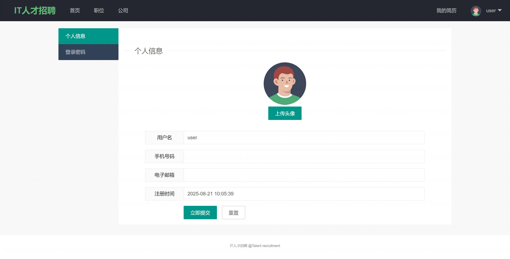
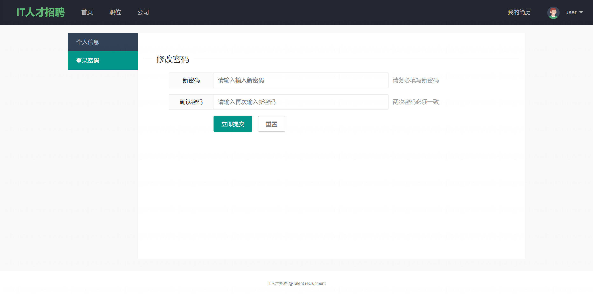

基于 Spring Boot 的人才招聘系统
=

### 完整代码获取地址：从戎源码网 ([https://armycodes.com/](https://armycodes.com/))
### 作者微信：19941326836  QQ：952045282 
### 承接计算机毕业设计、Java毕业设计、Python毕业设计、深度学习、机器学习
### 选题+开题报告+任务书+程序定制+安装调试+论文+答辩ppt 一条龙服务
### 所有选题地址https://github.com/nature924/allProject

一、项目介绍
---

基于 Spring Boot 的人才招聘系统，系统角色为普通用户(user)、管理员(admin)，主要功能如下

普通用户（user）：
基本操作：注册、登录（验证码）、修改密码、获取/修改个人信息、上传头像
简历管理：新增/编辑/保存简历、上传简历照片、查看个人简历详情
职位浏览：按条件检索职位（关键字、城市、学历、经验、发布时间等）、查看职位详情
公司查看：查看公司列表、公司详情
私信功能：与 HR/其他用户点对点聊天、查看聊天列表与未读信息

管理员（admin）：
基本操作：登录、修改密码、获取/修改个人信息
用户管理：分页筛选用户、查看详情、新增用户、修改/删除用户、锁定/解锁用户
公司管理：分页筛选公司、查看/编辑/删除公司、公司入驻审批、统计公司维度数据
岗位管理：后台分页筛选岗位、查看/编辑/删除岗位、岗位统计
简历管理：后台分页筛选/查看/删除简历
字典管理：管理城市/行业/字典类型与字典值（供前端下拉）
聊天管理：后台查看聊天记录、分页查询
仪表盘：系统汇总统计（用户数、简历数、公司数、岗位数、城市覆盖等）
公共功能/细节：
验证码支持（Kaptcha）用于登录/注册安全校验

二、项目技术
---
- 编程语言：Java
- 数据库：MySQL
- 项目管理工具：Maven
- 前端技术：VUE、HTML、Jquery、Bootstrap
- 后端技术：Spring、SpringMVC、MyBatis

三、运行环境
---
- 操作系统：Windows、macOS都可以
- JDK版本：JDK1.8以上都可以
- 开发工具：IDEA、Ecplise、Myecplise都可以
- 数据库: MySQL5.7以上都可以
- Tomcat：任意版本都可以
- Maven：任意版本都可以

四、运行截图
---

### 程序截图：

